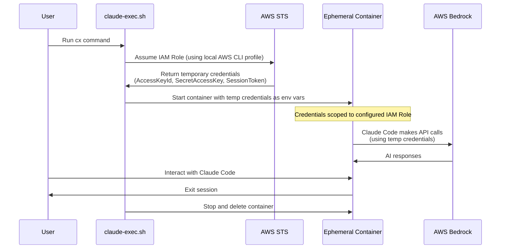

# Claude Exec

- Run Claude Code in a container to limit its scope of access
- Bill usage to your AWS Account

## Problem

Running Claude Code on your workstation gives Claude the same level of access that the user has. Filesystem, environment variables, AWS profiles, ability to install software, all the things you might not want to hand over to an AI agent are made available.

## Solution

This project provides a way to run Claude Code in a container using AWS Bedrock as the inference provider. The container boundary allows us to be more intentional about what we choose to allow the agent to read and write in both the local and cloud environments, as well as provide an ephemeral container on each run that will be discarded when exiting the process.

Running Claude Exec will:

- Fetch temporary AWS Credentials for Claude's IAM Role
- Run the Claude Code container in your local container engine
- Mount the current working directory as a volume at the path `/src` inside the container
- Expose only the env vars that we want to share with the running container

## AWS Billing

The default config uses AWS Bedrock as the inference provider. Bedrock provides pay-as-you-go billing. No Claude subscription required. This is enabled via the `CLAUDE_CODE_USE_BEDROCK=1` env variable.

## Architecture



The diagram shows how temporary AWS credentials are obtained via IAM role assumption and securely passed to the ephemeral container, limiting Claude's access to only what the configured IAM role permits.

## Quick Start

- Ensure you have setup the necessary [dependencies](#dependencies).
- Copy the example config to your home dir `cp ./.claude-exec.example ~/.claude-exec`.
- Configure your environment at `~/.claude-exec`.
- Create shell symlink `./claude-exec.sh symlink`.
  - You should now have the `cx` symlink in your path.
- Build the container image `cx build`
- Run the container from any location on disk `cx`
  - The current working directory will be mounted at `/src` inside the container.
  - Claude's AWS Access will be restricted to the configured `AWS_IAM_ROLE`.
  - The container will be stopped/deleted on exit.

## Configure

As mentioned in the [Quick Start](#quick-start), the default location for the config file is at `~/.claude-exec` and you should use the provided `.claude-exec.example` file as a template.

If you'd like to specify an alternate path to a config file, you may set `ENV_FILE=<path>` on the command line while invoking `cx`.

The config file is formatted as shell variables. The config is passed to the container runtime via `--env-file` argument.

| Variable | Required | Default | Description |
|----------|----------|---------|-------------|
| `RUNTIME` | Yes | - | Container runtime to use (e.g., `docker`, `podman`, `nerdctl`) |
| `IMAGE_TAG` | Yes | - | Tag for the container image (e.g., `localhost/claude:v1.0.0`) |
| `AWS_IAM_ROLE` | Yes | - | ARN of the IAM role that Claude Code will use |
| `AWS_REGION` | No | - | AWS region to use for Bedrock API calls (e.g., `us-east-1`) |
| `AWS_PROFILE` | No | `default` | AWS CLI profile to use for assuming the IAM role |
| `AWS_SESSION_DURATION` | No | `3600` | Duration in seconds for AWS STS session (max 43200, requires IAM role max-session-duration to be set accordingly) |
| `CLAUDE_CODE_USE_BEDROCK` | No | - | Set to `1` to use AWS Bedrock instead of Anthropic API for inference |
| `ANTHROPIC_MODEL` | No | - | ARN of a custom Application Inference Profile for cost attribution |
| `CLAUDE_OPTIONS` | No | - | Additional command-line options to pass to the Claude CLI |

## Dependencies

### Local

- A container runtime such as [Podman](https://podman.io/)
- [AWS CLI](https://docs.aws.amazon.com/cli/latest/userguide/getting-started-install.html), [jq](https://jqlang.org/download/)

### Cloud Infra

- [Submit Use Case Details](https://code.claude.com/docs/en/amazon-bedrock#1-submit-use-case-details) to enable Anthropic Models in your AWS Account (enablement is not immediate).
- An AWS IAM Role for Claude to use, one of your local AWS CLI profiles needs to be able to assume this role for the auth step.
  - The policies attached to this role provide hard limits on what Claude Code can do in your AWS env.
  - See the minimum required policy below.
- Optional step: create an [Application Inference Profile](https://docs.aws.amazon.com/bedrock/latest/userguide/inference-profiles-create.html) to attribute cost of tool usage, pass its ARN via `ANTHROPIC_MODEL` config var.

On the initial setup, the AWS Account owner will receive AWS Marketplace emails confirming subscriptions to a couple Anthropic Models (Haiku, Sonnet). At the time of this writing, these subscriptions do not cost anything, it is a result of how the licensing works.

#### Minimal IAM Policy

This is the minimal policy for Claude Code's IAM Role in order to successfully enable inference calls. If you want Claude to have power to read/write cloud resources, you would need to stack those policies on to the role as well.

```json
{
    "Version": "2012-10-17",
    "Statement": [
        {
            "Sid": "ClaudeCode",
            "Effect": "Allow",
            "Action": [
                "bedrock:InvokeModel",
                "aws-marketplace:ViewSubscriptions",
                "aws-marketplace:Subscribe"
            ],
            "Resource": "*"
        }
    ]
}
```

## Container

Based on `node:lts-bookworm-slim`, installs the Claude Code npm package along with some minimal utilities. You will need to build this image once in your local env.
